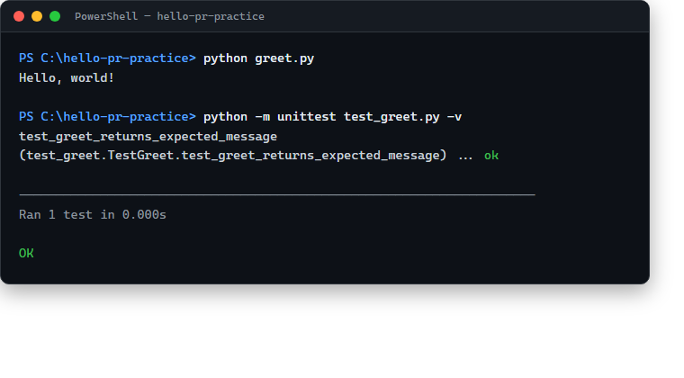

# hello-pr-practice

[](https://github.com/cj6320cj-k/hello-pr-practice/actions/workflows/test.yml)
[](https://github.com/cj6320cj-k/hello-pr-practice/pulls)
[](LICENSE)

A tiny practice repository for learning the Git/GitHub pull request workflow:
branch → commit → push → open a PR.

## What this repo does

`greet.py` prints a friendly greeting.

```bash
python greet.py
```

## Running the tests

```bash
python -m unittest test_greet.py
```

## Example output


